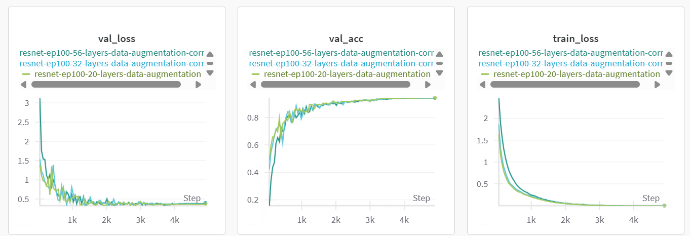
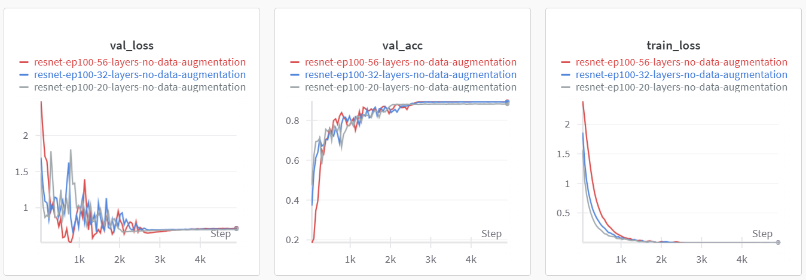
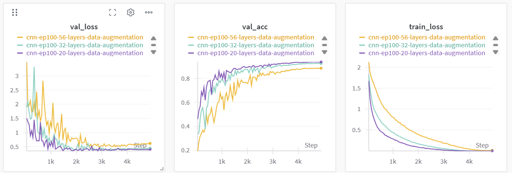
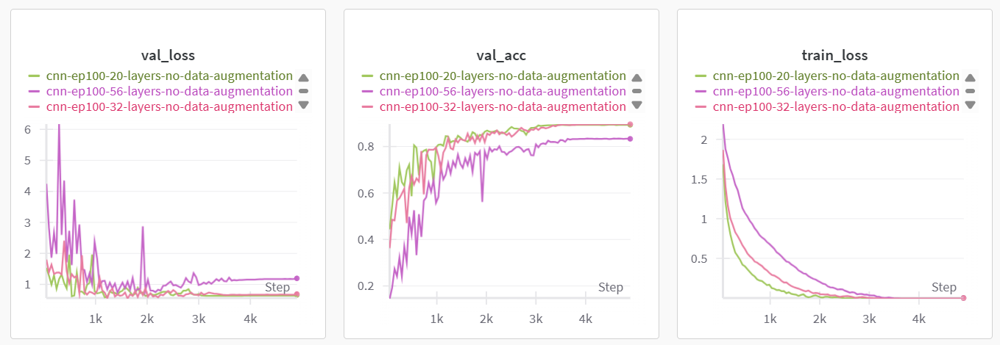
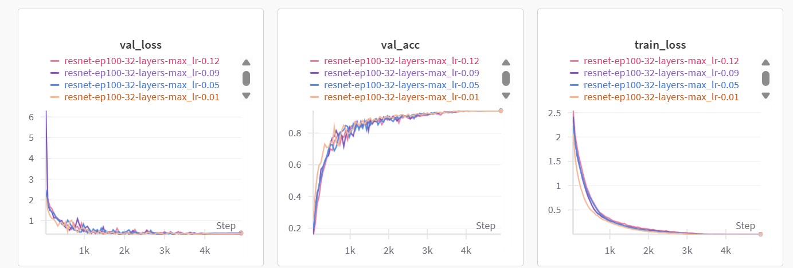

# ResNet

In brief, I have tried: 
- ResNet-20, ResNet-32, ResNet-56. 
- CNN-20, CNN-32, CNN-56. (without residual connections)
- With and without data augmentation for the above networks.

## Architecture
The ResNet architecture in `models/resnet.py` is defined by the `ResNet` class, which inherits from `ImageClassificationBase`.

The CNN architecture is basically the same as the ResNet architecture, but without the residual connections, and is defined by the `CNN` class. It also inherits from `ImageClassificationBase`.

**Core Building Blocks:**

*   **`conv_block(in_channels, out_channels, pool=False, stride=1)`:**
    *   A fundamental unit consisting of a 3x3 `nn.Conv2d` layer, `nn.BatchNorm2d`, and `nn.GELU` activation.
    *   Optionally includes an `nn.MaxPool2d(2)` layer if `pool=True`.
    *   The `stride` parameter controls the convolutional stride.

*   **`ResidualBlock(in_channels, out_channels, stride=1)`:**
    *   The core component of the ResNet.
    *   It contains two `conv_block` layers. The first `conv_block` uses the provided `stride` (for potential downsampling), and the second `conv_block` always uses `stride=1`.
    *   Implements a shortcut (skip) connection:
        *   The output of the two `conv_block`s is added to the input of the `ResidualBlock`.
        *   If the `stride` is not 1 or `in_channels` does not match `out_channels` (i.e., dimensions change), the shortcut path uses a 1x1 `nn.Conv2d` followed by `nn.BatchNorm2d` to project the input to the correct shape for addition.
    *   A `F.gelu` activation is applied after the addition of the main path and the shortcut path.

*   **`BasicBlock(in_channels, out_channels, stride=1)`:**
    *   Similar to `ResidualBlock` but without the shortcut connection.
    *   It contains two `conv_block` layers. The first `conv_block` uses the provided `stride`, and the second uses `stride=1`.

**Layer Summary:**

**`ResNet` Class Layer Sequence:**
1.  **Initial Convolution (`self.conv1`):** A `conv_block` (3x3 Conv2d -> BatchNorm2d -> GELU).
2.  **Stage 1 (`self.stage1`):** A sequence of `ResidualBlock`s. The first block in this stage typically has `stride=1`.
3.  **Stage 2 (`self.stage2`):** A sequence of `ResidualBlock`s. The first block in this stage has `stride=2` for downsampling.
4.  **Stage 3 (`self.stage3`):** A sequence of `ResidualBlock`s. The first block in this stage has `stride=2` for further downsampling.
5.  **Average Pooling (`self.avgpool`):** `nn.AdaptiveAvgPool2d((1, 1))`.
6.  **Flatten:** `torch.flatten`.
7.  **Fully Connected (`self.fc`):** `nn.Linear` layer.

**`CNN` Class Layer Sequence (No Residual Connections):**
1.  **Initial Convolution (`self.conv1`):** A `conv_block` (3x3 Conv2d -> BatchNorm2d -> GELU).
2.  **Stage 1 (`self.stage1`):** A sequence of `BasicBlock`s. The first block in this stage typically has `stride=1`.
3.  **Stage 2 (`self.stage2`):** A sequence of `BasicBlock`s. The first block in this stage has `stride=2` for downsampling.
4.  **Stage 3 (`self.stage3`):** A sequence of `BasicBlock`s. The first block in this stage has `stride=2` for further downsampling.
5.  **Average Pooling (`self.avgpool`):** `nn.AdaptiveAvgPool2d((1, 1))`.
6.  **Flatten:** `torch.flatten`.
7.  **Fully Connected (`self.fc`):** `nn.Linear` layer.

## Training settings
- optimizer: `torch.optim.AdamW`
- scheduler: `torch.optim.lr_scheduler.OneCycleLR` (default settings, max_lr=0.01, div_factor=25, pct_start=0.3)
- loss function: `torch.nn.CrossEntropyLoss`
- batch_size: 1024
- epochs: 100
- weight decay: 1e-4
- data augmentation: 
```
transform_train_list = [
                transforms.RandomCrop(image_size, padding=4, padding_mode='reflect'),
                transforms.RandomHorizontalFlip(),
                transforms.ToTensor(),
                transforms.Normalize(cifar10_mean, cifar10_std, inplace=True),
]
```

## Results
### ResNet & With Data Augmentation

As the figure shows, the three ResNet models with data augmentation share similar training and validation curves, reaching a validation accuracy of around 94%. The validation loss curves indicate that all three models fit well on the CIFAR-10 dataset. And the three models all have enough parameters to fit the training data, leading to the same final validation accuracy.

### ResNet & Without Data Augmentation

As the figure shows, the three ResNet models without data augmentation exhibit more variance in their training and validation curves. The validation accuracy is lower, peaking at around 89%. The models also show signs of overfitting, as indicated by the diverging training and validation loss curves.

### CNN & With Data Augmentation

The figure is actually interesting. We can see two obvious phenomena:
1. When the number of layers increases, the validation accuracy drops. This phenomenon is a classical example of the **degradation problem** in deep neural networks, which is exactly what ResNets were designed to solve. The validation accuracy for the CNN-20 model is around 93.7%, while the CNN-32 and CNN-56 models achieve around 92.5% and 88.5%, respectively.
2. The more layers, the more variance in the training and validation curves. The CNN-20 model has a relatively stable training and validation curve, while the CNN-32 and CNN-56 models show more fluctuations, indicating that they are harder to train.

Here are possible reasons for this phenomenon:
1. **Vanishring Gradient Problem:** As the number of layers increases, the gradients can become very small, making it difficult for the initial layers of the model to learn effectively. The deeper models struggle to train their initial layers, leading to lower validation accuracy.
2. **Optimization Difficulties:** Deeper networks have more complex loss landscapes, which can make optimization harder. Without skip connections, it becomes increasingly difficult for the optimizer to find good solutions.
3. **Identity Mapping Problem:** Theoretically, a deeper network should perform at least as well as a shallower one (it could learn identity mappings for extra layers). However, in practice, it's very difficult for plain CNNs to learn these identity mappings. ResNets solve this by providing explicit skip connections that make identity mappings easier to learn.
4. **Train Instability:** The figure shows that with more layers, the training and validation curves become more unstable. This instability indicates a more dramatically changing loss landscape, which can lead to difficulties in optimization.

### CNN & Without Data Augmentation

This figure basically shows all the phenomena we discussed above. The validation accuracy is lower, peaking at around 85% due to lack of data augmentations. Also, the deeper models (CNN-32 and CNN-56) show more variance in their training and validation curves, indicating that they are harder to train.

### ResNet with different learning rates

I have conducted experiments with different learning rates for the ResNet-32 model. I use the `OneCycleLR` scheduler with different `max_lr` values: 0.01, 0.05, 0.09, and 0.12. The results show that all models converges to the same final validation accuracy of around 94%. This is a sign that the ResNet architecture is robust to different learning rates, and the `OneCycleLR` scheduler is effective in finding a good learning rate for training. Also, the CIFAR-10 dataset is relatively small, so the models can fit the data well with different learning rates.